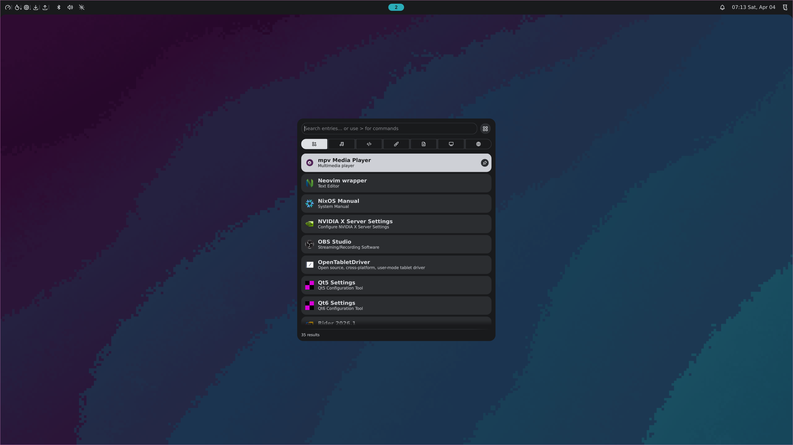
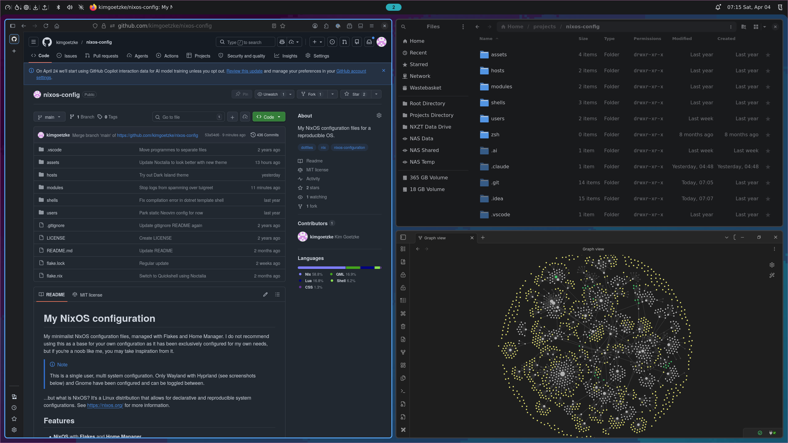
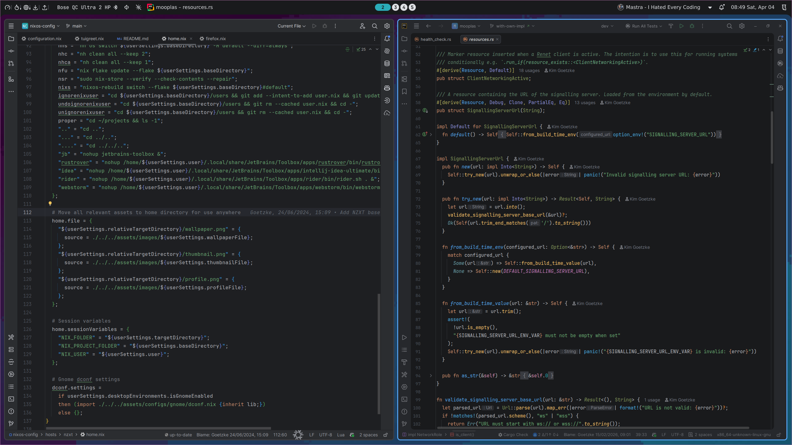

# My NixOS configuration

My minimalist NixOS configuration files, managed with Flakes and Home Manager. I do not recommend using this as a base
for your own configuration as it has been exclusively configured for my own needs, but if you're a noob like me, you may
take inspiration from it.

> [!NOTE]
> This is a single user, multi system configuration. Only Wayland with Hyprland (see screenshots below) and Gnome have
> been configured and can be toggled between.

...but what is NixOS? It's a Linux distribution that allows for declarative and reproducible system configurations.
See [https://nixos.org/](https://nixos.org) for more information.

## Features

- **NixOS** with **Flakes** and **Home Manager**
- **Wayland** with **Hyprland** (or **X11** with **Gnome**) as desktop environment
- **Noctalia**'s status bar (or **HyperPanel** or **Waybar** with **Mako** notifications) on Wayland
- **Noctalia**'s built-in screen locking (or **Hyprlock** with Waybar/Hyprpanel) and **Hypridle** for idle management
- **Noctalia**'s built-in application launcher (or **Rofi** with Waybar/Hyprpanel)
- **Firefox** web browser
- **WezTerm** (or **Alacritty**) terminal emulator with **Zsh** shell
- **VS Code** and **Neovim** text editors and **JetBrains Toolbox** for IDEs
- **Yazi** (terminal) and **Nautilus** (GUI) file managers
- **Btop** system monitoring
- **Cliphist** clipboard manager
- **Mpv** media player
- **Satty** with **Slurp** and **Grim** for screenshots
- **Blueman** bluetooth manager
- **Posting** terminal HTTP client
- **Obsidian** note-taking application
- **Kalker** calculator

## Screenshots







## Usage

#### Preparation

1. Follow official guides to prepare your HDD and install NixOS e.g. from a USB.
2. Clone this repository and move your existing `hardware-configuration.nix` (by default in `/etc/nixos/`) file to
   `/hosts/{your host}/`.
3. Copy `home.nix` and `configuration.nix` from an existing host to begin with, unless you have your own already.
4. Create a copy of the file `/users/user-template.nix` in the same folder and name it `user.nix`.
5. Complete the `user.nix` file with your own details.
6. Run the following commands:
   ```shell
   git add hosts/{your host}/hardware-configuration.nix
   cd users
   git rm --cached user.nix # If you've already added it
   git add --intent-to-add user.nix
   git update-index --assume-unchanged user.nix   
   ```
   This will prevent you from accidentally committing your user configurations while stopping the
   nasty `No such file or directory` error.
7. Build the system.

> [!NOTE]
> After the first build you can use aliases to manage your user.nix file. See `home.shellAliases` in `home.nix`.
> - Use `ignorenixuser` to execute the `git add`, and `git update-index` commands above.
> - Use `undoignorenixuser` to run the `git rm` command above.

#### Build

The below assumes that this repo is cloned to `~/projects/nixos-config`. If that's not the case, replace the path
accordingly.

```shell
nixos-rebuild switch --flake ~/projects/nixos-config#default
```

> [!NOTE]
> After the first build you can use a number of aliases that use the host name and project directory you provided.
> Examples: `nht` to test and `nhs` to switch. See `home.shellAliases` in `home.nix` for more information.

After first run or once `nh` installed otherwise, you can also use:

1. For testing:
    ```shell
    nh os test ~/projects/nixos-config -H default
    ```
2. Once finalised (with boot entry):
    ```shell
    nh os switch ~/projects/nixos-config -H default
    ```
3. Or apply after reboot:
    ```shell
    nh os boot ~/projects/nixos-config -H default
    ```

If you see errors, run `journalctl -u home-manager-$USER.service`.

#### Clean up

Clean up user generations, leaving only the most recent generation, with:

```shell
nh clean all --keep 3 --keep-since 2d --dry
```

Note that:

- `--keep 3` - At least keep 3 generations [default: 1]
- `--keep-since 2d` - At least keep gcroots and generations of the past 2 days [default: 0h]
- `all` instead of the above will do what it says

#### Update

Update with:

```shell
nix flake update --flake ~/projects/nixos-config
nh os switch ~/projects/nixos-config -H default
```

Or update a specific input only:

```shell
nix flake update home-manager
nh os switch ~/projects/nixos-config -H default
```

## Reminders

#### Running regular updates?

A few aliases have been set up, allowing you to manage the process of updating the OS by simply running:

```shell
nhc && nfu && nhb
```

- `nhc` - Cleans up user generations using `nh clean all --keep 2`
- `nfu` - Updates the flake using `nix flake update --flake ${userSettings.baseDirectory}`
- `nhb` - Switches to the new generation using `nh os boot ${userSettings.baseDirectory} -H default`

#### When the OS doesn't build and errors make even less sense than usual?

In the repo's root, run:

```shell
nixos-rebuild switch --flake .#default --show-trace
```

Then consider this:

- Sometimes running `nix-store --verify --check-contents --repair` (or the alias `nsr`) can fix issues that make no
  sense at all.
- Is the error font-related, and you've recently made changes to your fonts? Try running `fc-cache -f` because, for some
  reason, NixOS won't do it for you and happily point at the wrong font path.

#### Using Gnome and made some config changes in the UI?

Once you've done this once, it's probably best to simply run `dconf watch /` and update the relevant .nix file. If
you've never configured Gnome UI changes in NixOS before, follow these steps:

1. Get the latest settings and convert them to a Nix file:
   ```shell
   dconf dump / > ./assets/configs/gnome/dconf.settings
   
   # Or... (but it's quite buggy and breaks for me)
   dconf dump / | dconf2nix > ./assets/configs/gnome/dconf-raw.nix
   ```
2. Convert the settings to a Nix file:
   ```shell
   dconf2nix -i ./assets/configs/gnome/dconf.settings -o ./assets/configs/gnome/dconf-raw.nix
   ```
   If things break, which they usually do, follow the error messages and fix/remove the offending line(s).
3. Copy everything you need into a new file in the same directory named `dconf.nix` and make sure it's imported by
   `home.nix`. In case of errors, consider replacing `mkTuple` with `lib.hm.gvariant.mkTuple` and `mkUint32`
   with `lib.hm.gvariant.mkUint32` in `dconf.nix` or adding `with.lib.hm.gvariant` at the top of the file.

Check `systemctl status home-manager-$USER` and ensure the service started successfully, if not, dig in with
`journalctl -u home-manager-$USER` and make sure to carefully read the error.

#### Using Hyprland and observed the error: `Failed to start Home Manager environment`?

Run the following command to see the detailed logs:

```shell
journalctl -xe --unit home-manager-$USER
```

If the error is related to `home-manager.backupFileExtension`, then search this repo for `backupFileExtension` and
change the value e.g. by increasing the count. This will fix the issue.
