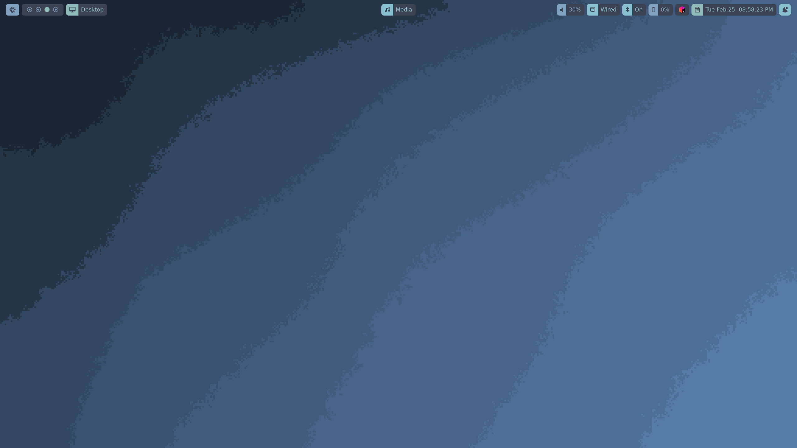
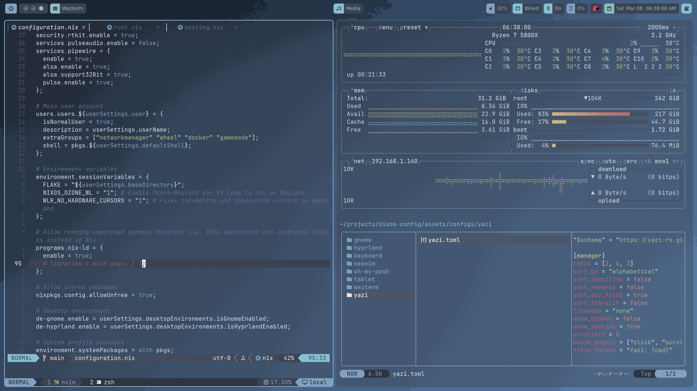

# My NixOS configuration

My minimalist NixOS configuration files, managed with Flakes and Home Manager. I do _not_ recommend using this as a base
for your own configuration as it has been exclusively configured for my own needs, but if you're a noob like me, you may
take inspiration from it.

> [!NOTE]
> This is a single user, multi system configuration. Only Wayland with Hyprland (see screenshots below) and Gnome have
> been configured and can be toggled between.

...but what is NixOS? It's a Linux distribution that allows for declarative and reproducible system configuration.
See [https://nixos.org/](https://nixos.org) for more information.

## Screenshots





## How to use

#### Preparation

1. Follow official guides to prepare your HDD and install NixOS e.g. from a USB.
2. Clone this repository and move your existing `hardware-configuration.nix` file to `/hosts/{your host}/`.
3. Copy `home.nix` and `configuration.nix` from an existing host to begin with, unless you have your own already.
4. Create a copy of the file `/users/user-template.nix` in the same folder and name it `user.nix`.
5. Complete the `user.nix` file with your own details.
6. Run the following commands:
   ```shell
   cd users
   git rm --cached user.nix # If you've already added it
   git add --intent-to-add user.nix
   git update-index --assume-unchanged user.nix   
   ```
   This will prevent you from accidentally committing your user configurations while stopping the
   nasty `No such file or directory` error.
7. Build the system.

#### Build

The below assumes that this repo is cloned to `~/projects/nixos-config`. If that's not the case, replace the path
accordingly.

```shell
nixos-rebuild switch --flake ~/projects/nixos-config#default
```

> [!NOTE]
> After the first build you can use a number of aliases that use the host name and project directory you provided.
> Examples: `nht` to test and `nhs` to switch. See `home.shellAliases` in `home.nix` for more information.

After first run or once `nh` installed otherwise, you can also use:

1. For testing:
    ```shell
    nh os test ~/projects/nixos-config -H default
    ```
2. Once finalised (with boot entry):
    ```shell
    nh os switch ~/projects/nixos-config -H default
    ```
3. Or apply after reboot:
    ```shell
    nh os boot ~/projects/nixos-config -H default
    ```

If you see errors, run `journalctl -u home-manager-$USER.service`.

#### Clean up

Clean up user generations, leaving only the most recent generation, with:

```shell
nh clean all --keep 3 --keep-since 2d --dry
```

Note that:

- `--keep 3` - At least keep 3 generations [default: 1]
- `--keep-since 2d` - At least keep gcroots and generations of the past 2 days [default: 0h]
- `all` instead of the above will do what it says

#### Update

Update with:

```shell
nix flake update ~/projects/nixos-config
nh os switch ~/projects/nixos-config -H default
```

Or update a specific input only:

```shell
nix flake update home-manager
nh os switch ~/projects/nixos-config -H default
```

## Reminders

#### Using Gnome and made some config changes in the UI?

Once you've done this once, it's probably best to simply run `dconf watch /` and update the relevant .nix file. If
you've never configured Gnome UI changes in NixOS before, follow these steps:

1. Get the latest settings and convert them to a Nix file:
   ```shell
   dconf dump / > ./assets/configs/gnome/dconf.settings
   
   # Or... (but it's quite buggy and breaks for me)
   dconf dump / | dconf2nix > ./assets/configs/gnome/dconf-raw.nix
   ```
2. Convert the settings to a Nix file:
   ```shell
   dconf2nix -i ./assets/configs/gnome/dconf.settings -o ./assets/configs/gnome/dconf-raw.nix
   ```
   If things break, which they usually do, follow the error messages and fix/remove the offending line(s).
3. Copy everything you need into a new file in the same directory named `dconf.nix` and make sure it's imported by
   `home.nix`. In case of errors, consider replacing `mkTuple` with `lib.hm.gvariant.mkTuple` and `mkUint32`
   with `lib.hm.gvariant.mkUint32` in `dconf.nix` or adding `with.lib.hm.gvariant` at the top of the file.

Check `systemctl status home-manager-$USER` and ensure the service started successfully, if not, dig in with
`journalctl -u home-manager-$USER` and make sure to carefully read the error.